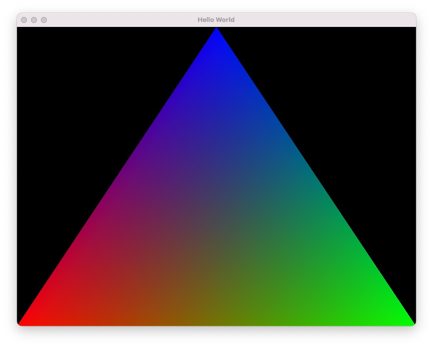

Game engine built with SDL3::GPU (Early stages - WIP)

- Only tested in MacOs / METAL so far (use shadercross to cross compile shaders to other platforms)
- Contains Minimal libraries
- Sprite batcher (minimise draw calls)
- Custom Immediate mode GUI (WIP)
- Next up: ECS

