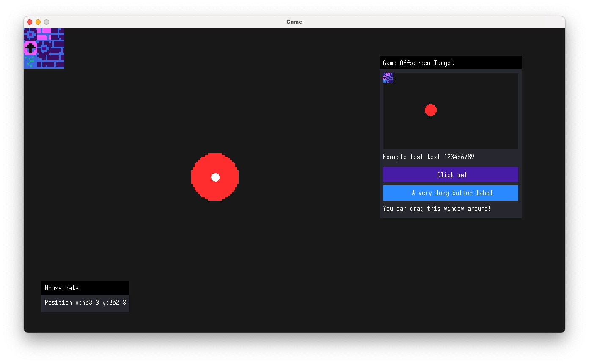

# Game Engine (WIP) – Powered by SDL3::GPU

## A lightweight, experimental game engine focused on performance and minimal dependencies.

- Platform Support: Currently tested on macOS/Metal (cross-compilation via shadercross for other backends).
- Dependencies: Minimal (SDL3, nalgebra, stb_image).

### Features:

- Hot-reloadable game DLLs for rapid iteration
- Sprite batching to reduce draw calls
- Multiple shader/material support
- Custom immediate-mode GUI (WIP)
- Custom global allocator (WIP)
- Roadmap: Entity Component System (ECS) integration

